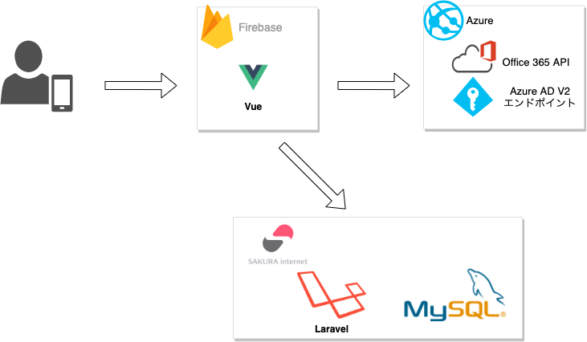

# Team-Tool  

## 2020/01/09 アーカイブ(仮)  

勢い任せの実装&長い間の放置により改修が困難になってしまいましたのでarchive(仮)とします。戒めとして残しておきます・・・・  

## なにをつくったか  

前職で社内コミュニケーションツールがなかったのと、勤怠報告が紙媒体だったのでそれらの機能を盛り込んだwebアプリを趣味として作成したものです。  
社員にはoffice365のアカウントが配布されていたので、そのアカウントと連携できる仕様にしました。


## システム構成図  



## 使用技術、ツール、環境

| 項目 | 用途 | 備考 |
|:-----------:|:-----------:|:-----------:|
| JavaScript | 言語 | |
| Vue.js | フレームワーク | |
| bulma | CSSフレームワーク |  |
| Sass | CSSメタ言語 |  |
| npm | 依存管理 |  |
| Azure | Office連携 | AOuth認証など |
| Firebase | Hosting | Vueをデプロイ |

※サーバーサイドはPHP(Laravel) + MySQL + さくらレンタルサーバー

## 依存ライブラリ  

| 項目 | 用途 | 備考 |
|:-----------:|:-----------:|:-----------:|
| axios | HTTPクライアント | |
| vue-router | ルーター | |
| vuex | 状態管理 | |
| xlsx | エクセル関連 | 勤怠報告機能で使用 |

## フォルダ構成  
```
──src/  
   ├── api ...OfficeAPIクライアント周り、レスポンスのモック  
   │
   ├── assets ...静的ファイル  
   │
   ├── components ...コンポーネント  
   │
   ├── mixin ...ミックスイン  
   │
   ├── router ...ルーター制御  
   │
   ├── store ...状態管理  
   │
   └── views ...画面
```  

## デモページ  

レスポンシブですが __スマートフォンでの閲覧を推奨です。__  
サインインの際、アカウントはこちらを使用してください。  

ログインアドレス  
>tool.demo@outlook.com  

パスワード  
>team-tool-demo  

URL  
>https://team-tool-demo.firebaseapp.com  

## できること  

アカウントに登録されている直近3ヶ月のカレンダーイベントを表示。  
シェアポイントで共有されたファイル一覧(更新順)  
投稿(タイムラインの様な機能)  
勤怠管理(休み、早退、遅刻、残業時のみを記録するもの)  
指定月の勤怠管理提出(ログインアカウントから人事へメール送信)
